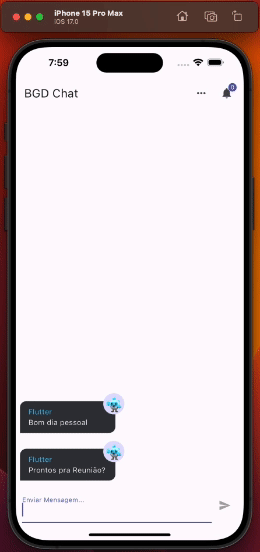
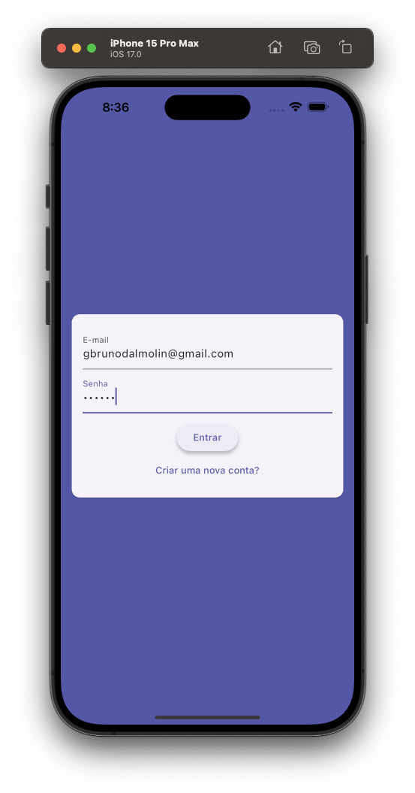
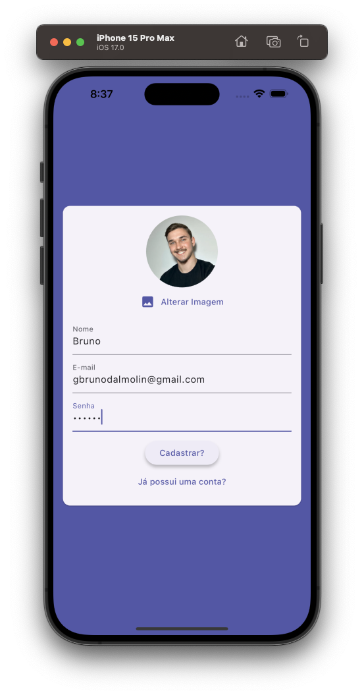
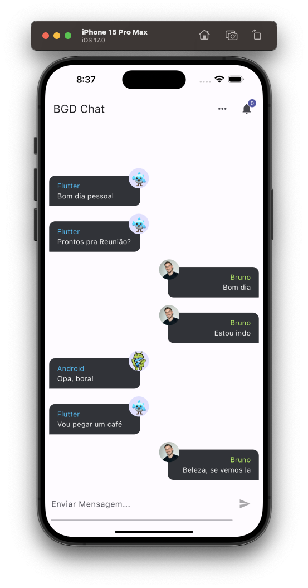

---

## Chat App

---

<div align="center">

**Language:**

[](README.md)
[](README.pt-br.md)

</div>

---
## ℹ️ Sobre este repositório
Aplicativo Chat escrito no Flutter com integração ao Firebase Cloud Messsaging.

O objetivo principal deste repositório é demonstrar o aplicativo desenvolvido para treinar meus conhecimentos durante o curso de Flutter da empresa [COD3R](https://www.udemy.com/course/curso-flutter/).

---
## ⚙️ Funcionalidades
Este app tem as seguintes funcionalidades:

- Cadastro de Usuário.
- Login de Usuário.
- Integração com Firebase.
- Notificação a partir do Cloud Messaging do Firebase.

---
## 👁️ Pré-visualização

<h1 align="center">

</h1>

<h1 align="center">



</h1>

---
## 🧪 Tecnologias
Este projeto foi desenvolvido usando as seguintes tecnologias:

- [Flutter 3.16.9](https://docs.flutter.dev/)
- [Dart 3.2.6](https://dart.dev/)
- [provider](https://pub.dev/packages/provider)
- [image_picker](https://pub.dev/packages/image_picker)
- [firebase_core](https://pub.dev/packages/firebase_core)
- [cloud_firestore](https://pub.dev/packages/cloud_firestore)
- [firebase_auth](https://pub.dev/packages/firebase_auth)
- [firebase_storage](https://pub.dev/packages/firebase_storage)
- [firebase_messaging](https://pub.dev/packages/firebase_messaging)

---
## ⚡ Instalação

Primeiramente clone este projeto usando:

```bash
  git clone https://github.com/GoedertDalmolin/chat.git
  cd chat
```

Por fim compile e execute o projeto.

---
</> Desenvolvido por [GoedertDalmolin](https://github.com/GoedertDalmolin) 👋
---
